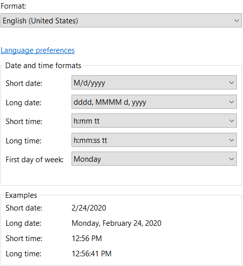
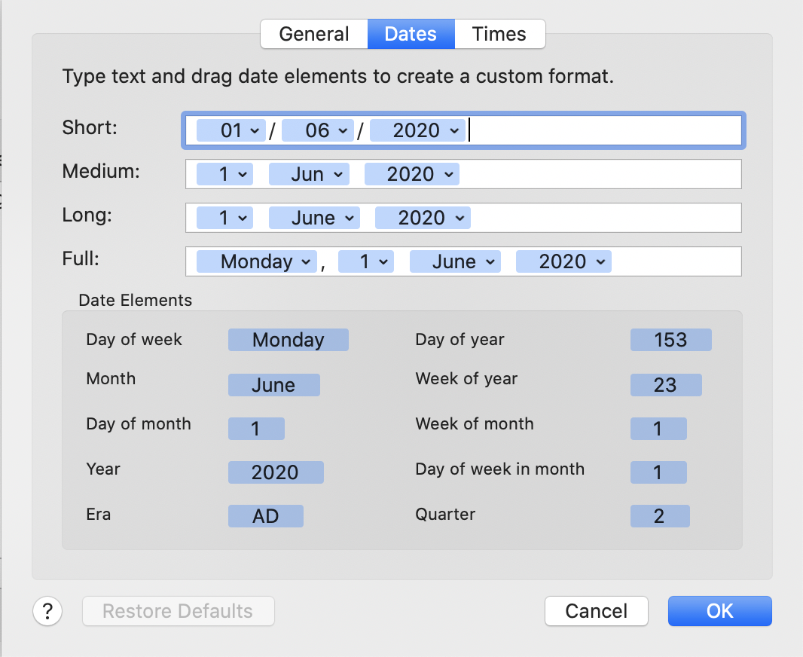

# Globe

Provides localization services for Electron and the browser.
Respects the OS date and time format configuration.

## Installation

`npm i`[`@microsoft/globe`](https://www.npmjs.com/package/@microsoft/globe)

## Usage

```typescript
import { TimeStringFormat, DateTimeFormatOptions, DateTimeFormatter } from 'globe';

// Instantiate the formatter
const dateTimeFormatter = new DateTimeFormatter(locale: string | ILocaleInfo);
```

`locale` is either a locale string (e.g.: `en-US`) or `ILocaleInfo` instance:

```typescript
type ILocaleInfo = {
  // Supported platform
  platform: 'windows' | 'macos';

  // OS date & time format settings (see below for OS support)
  regionalFormat: string; // e.g.: 'en-US'
  shortDate: string; // e.g.: 'dd/MM/y'
  longDate: string; // e.g.: 'd MMMM y'
  shortTime: string; // e.g.: 'HH:mm'
};
```

To format a date and time value:

```typescript
/**
 * Localize the date/time
 * @param date The date/time to localize
 * @param format The format to be used for the localization
 * @returns The localized date/time string
 */
function formatDateTime(date: number | Date, format: DateTimeFormatOptions) {
  return dateTimeFormatter.formatDateTime(date, format);
}
```

**The function throws** in case an unexpected OS date and time format string is
provided! Most likely this will happen if you feed it the OS strings verbatim and
the OS is configured with a custom date/time format string. If you don't desire
this behavior, you can choose your own fallback (and telemetry) by wrapping the
call to Globe and redoing it without OS-honoring support in case it fails with
the *Unexpected format string* error.

### OS Support

Globe is able to honor OS system date and time formatting settings, but it does
not do OS detection and date and time settings querying out of the box as these
features depend on the context you're using Globe in.

If you want to take an advantage of this feature, we recommend you follow this
pattern:

- Make `window.getLocaleInfoAsync` available (return `Promise<ILocaleInfo>`)
- Cache the result of that function and provide it in the `DateTimeFormatter`
  constructor
- Use the exported `getLocaleInfoAsync` alias function if you prefer, which
  wraps the `window.getLocaleInfoAsync` function for you:

```typescript
import { getLocaleInfoAsync } from '@microsoft/globe';
// Provide the supported platform name and obtain the OS locale settings
const localeInfo = await getLocaleInfoAsync(/* 'windows` | 'macos' */);
new DateTimeFormatter(localeInfo);
```

#### Windows

The values provided can be found in Date & Time this way:

- Click on the date and time in the taskbar
- Click on Adjust date and time
- Click on Region & language (here you see the values formatted)
- Click on Advanced
- Check the values of short date, long date and short time



#### macOS

- Click on the date and time in the menubar
- Click on Open date and time preferences
- Click on Date and time
- Click on Oppen language and region
- Click on Advanced
- Click on Dates
- Check the values of short and long



- Click on Times
- Check the value of


[MacOS format patterns reference](https://developer.apple.com/library/archive/documentation/Cocoa/Conceptual/DataFormatting/Articles/dfDateFormatting10_4.html#//apple_ref/doc/uid/TP40002369-SW1)

## Building

```sh
npm install
npm run build
```

## Testing

Build the package first: `npm run build`.

`npm test`

There is a [GitHub Actions workflow](.github/workflows/main.yml) which runs the
tests on every push to any branch.

## GitHub Release Publishing

GitHub Releases are made manually by @TomasHubelbauer at the moment.

## NPM Release Publishing

Don't forget to build prior to cutting a release!

```sh
# --tag=next pro pre-release (also include a pre-release tag in the version code)
npm publish [--tag=next]
# @microsoft/globe
```

Install the pre-release package using: `npm i @microsoft/globe@next`

NPM Releases are made manually by @TomasHubelbauer at the moment.

## Release Notes

### `3.4.0` 2020-10-29
Support quotes in format
Support K and k tokens for mac

### `3.3.0` 2020-10-057
Removed `SHORT_DATE_TIME_NO_YEAR`

### `3.2.0` 2020-10-05
Add new format `SHORT_DATE_TIME_NO_YEAR`

### `3.1.0` 2020-09-08
Add getLocaleInfoAsync to module export

### `3.0.1` 2020-09-04
Improve error logging for unknown formats

### `3.0.0` 2020-07-22
Avoid depending on Intl.DateTimeFormatParts which is not available in es5

### `2.8.1` 2020-07-20
SafeDateTimeFormat with fallback to UTC if timezone is not detected or provided
Use 0 instead of 24 for H and HH tokens

### `2.8.0` 2020-06-29

Precompute formats so that applying is faster.
Added FULL, FULL_WITH_YEAR, FULL_TIME, LONG_TIME_WITH_TIMEZONE, LONG_WITH_TIMEZONE, LONG_WITH_YEAR_TIMEZONE, SHORT and SHORT_WITH_YEAR formats.

### `2.7.4` 2020-06-29

Do not use `for...of` because of perf impact.

### `2.7.3` 2020-06-16

Improved performance, by adding more caching.

### `2.7.2` 2020-05-25

Fixed a bug in Windows AM/PM token detection in the OS formatting string.
Instead for looking for either `t` or `tt`, Globe was only looking for `tt`.

### `2.7.1` 2020-05-19

Fixed typo in seconds in long date and time format.

### `2.7.0` 2020-05-19

Added formatting rules for:

- Long date and time
- Long weekday and long time
- Long weekday and short time
- Short weekday and long time
- Short weekday and short time

### `2.6.2` 2020-05-14

Fixed an issue where Windows OS format string was treated as if it was a
macOS format string.

### `2.6.1` 2020-05-14

We've added preliminary handling for AM/PM (day period) format which
supports the `HOUR_ONLY` option when using the OS date and time format strings.
The supported OSs (macOS and Windows) do not expose a dedicated format string
for an hour-only scenario, so we detect whether the OS format string for
short date includes the AM/PM format string token and constuct a makeshift
`HOUR_ONLY` format string for that case which either also includes AM/PM or
doesn't depending on if the original short time format string did.

### `2.6.0` 2020-05-04

We've switched to a single-level cache between the pair made up by the locale
and the format options stringified and the DateTimeFormat Intl instance.

Previously the cache was two-level, a map for the locale (string) and a weak
map for the format options (object), which had the same performance, but was
more complex and needlessly so, because JSON.stringify is so fast being native
code, the overhead has actually decreased when using it for the cache key.

The access pattern of Globe is now such that the first call to `formatDate`
given an format options object (or `undefined`) takes about 20ms, which is
the cost of initializing and caching the Intl.DateTimeFormat instance and
subsequent calls are practically equivalent in speed to raw Intl, meaning
they take <1ms.

### `2.5.0` 2020-05-04

Add missing key coercion which caused the locale+format cache to have no effect
in case no format was provided.

### `2.4.0` 2020-05-04

Caching internal `Intl.DateTimeFormat` instances keyed by the given locale and
format object.

### `2.3.0` 2020-03-09

Added HOUR_ONLY pattern.

### `2.2.0` 2020-03-05

Added few more date time formatting patterns, like Medium and Full dates and times.

### `2.1.0` 2020-02-24

Refactored the `DateTimeFormatter` constructor to accept either a locale
string or an instance of `ILocaleInfo` and added information and support
for obtaining `ILocaleInfo` through OS settings.

### `1.0.2` 2020-02-11

Release a version with the release notes in the readme.

### `1.0.1` 2020-02-11

- Fixed a typo in the file name in the `module` field of `package.json`
- Fixed installation instructions to use the current scope - `@microsoft`
- Fixed the usage sample and clean up the readme a bit

### `1.0.0` 2020-02-06

Initial release of the code pulled out of a larger codebase for
public consumption.

## To-Do

### Set up Jest to run with TypeScript and TSDX and in watch mode

Right now the tests are too rudimentary and are in JavaScript. Doing this will make it
easier, faster and less error-prone to test the library.

### Set up automated GitHub and NPM releases

We don't cut releases too often, but this will still be useful to make the release
process reproducible, reliable and consistent.

### Add more docs, especially around formatting based on OS date time settings

We're in a process of redesigning the OS-formatting portion of this library and will
publish a design documentation first and an implementation PR second when we're ready
to invest more resources into improving this.

### Throw a custom error when hitting an unexpected OS date and time format string

This will be useful when attempting to catch this exact error. Right now we only throw
this error so barring programming errors any error that can possibly be caught is this
one, but it will be better to provide prototype equality (`e instanceof OSDateTimeError`)
to be able to catch more selectively and confidently.

## Contributing

Contributions are welcome (see the [CONTRIBUTING](./CONTRIBUTING.md) file),
though please keep in mind the work-in-progress proof-of-concept state.
Might make sense to just observe/discuss until the thing gets stable and well-documented.

## License

This project is licensed under the MIT License, see the [LICENSE](LICENSE) file for details.
